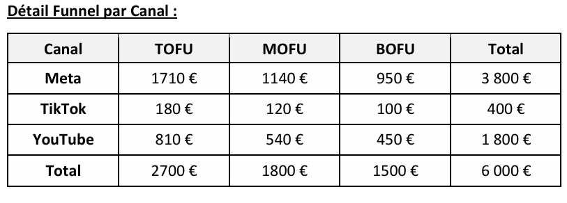

# Stratégie Digitale & Acquisition (SMA/SEO) - MYCOMM

# Contexte du projet
MYCOMM est une agence française spécialisée dans le voyage thématique lié au sport (Tournoi des 6 Nations, Formule 1, Football), générant un chiffre d'affaires de 18,1 millions d'euros en 2023. 
L'objectif de ce projet est de proposer une recommandation complète d'acquisition de trafic digital (B2C) pour optimiser les conversions sur leur site internet, face à un marché concurrentiel dominé par de grands acteurs et des plateformes de billetterie.

# Méthodologie et Analyse
1.  **Réflexion stratégique & SEO :** Analyse de l'offre, du positionnement concurrentiel, et audit du site web (sources de trafic, comportement mobile vs desktop). Le SEO est le principal moteur actuel (86 % des sessions), particulièrement grâce au blog, mais manque de CTA (Call to Action) pour transformer les visites en achats.
2.  **Création de Personas basés sur la donnée :** 
    *   **Julien (28 ans) :** Le persona "Volume". Fan de rugby, mobile-first, cherchant la rapidité et la fiabilité pour le Tournoi des 6 Nations.
    *   **Lucas (45 ans) :** Le persona "Valeur". À fort pouvoir d'achat, recherchant des expériences VIP/Premium clés en main.
3.  **Stratégie SMA (Social Media Advertising) :** Structuration de campagnes publicitaires selon l'entonnoir de conversion (Funnel : TOFU, MOFU, BOFU) avec la définition de KPIs précis (Impressions, CTR, Taux de conversion, ROAS, CAC).

# Recommandations et Répartition du Budget (SMA)
Pour un budget de campagne fictif de 6 000 €, la stratégie de diffusion sur 4 semaines a été répartie pour maximiser la visibilité et la conversion :
*   **Meta (Facebook & Instagram) - 63 % du budget :** Canal pilote de performance et de conversion, combinant une portée massive et un ciblage précis, idéal pour adresser nos deux personas.
*   **YouTube Ads - 30 % du budget :** Axé sur le storytelling et la valorisation d'expériences premium (idéal pour la cible de Lucas).
*   **TikTok Ads - 7 % du budget :** Ciblage axé sur la notoriété (TOFU) et l'engagement auprès des jeunes adultes (le public de Julien).

# Projections et R.O.I.
L'estimation des performances montre une rentabilité très inégale selon les segments :
*   **Canal le plus rentable :** Meta Ads se détache avec un coût par conversion estimé à environ 58 €, nettement inférieur à TikTok (80 €) et YouTube (100 €).
*   **ROAS (Return On Ad Spend) :** 
    *   L'investissement sur le persona "Premium" (Lucas) génère un ROAS excellent de 12 (panier moyen de 800 €).
    *   L'investissement sur le persona "Volume" (Julien) maintient un ROAS solide de 5 (panier moyen de 300 €).
*   **Conclusion :** Cibler des personas premium offre un retour sur investissement supérieur justifiant un investissement publicitaire plus important, tandis que la cible jeune reste stratégique pour générer du volume et de la notoriété.

---
